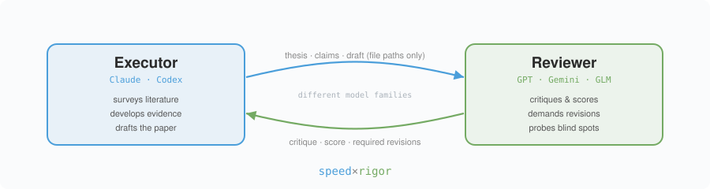
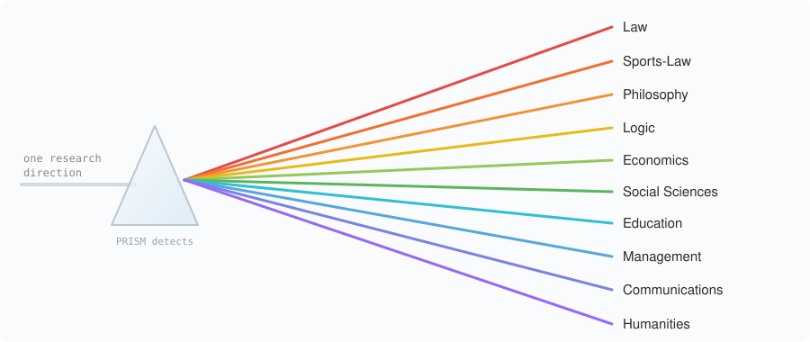
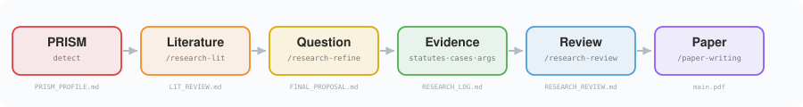

# Prism-H 📚⚖️

**面向人文社科的 Prism** —— 适用于 Claude Code（以及 Codex CLI、Cursor、Trae 等 agent）的学科感知研究流水线。

🤖 **AI agent：** 请改读 [`AGENT_GUIDE.md`](AGENT_GUIDE.md)，那是为 LLM 阅读组织的结构化版本。


[English README](README.md) | 中文

> 🪶 **把 AI 从一次性问答，变成持续积累的人文社科研究知识库。** 。

**Prism**（Pipeline for Research with Intelligent Subject Mapping）是一个**学科感知、用户主导**的全流程学术研究管线，并继承了 [Karpathy 的 wiki 知识库](https://gist.github.com/karpathy/442a6bf555914893e9891c11519de94f)——是一个集成了文献管理的科研助手。它像棱镜分光一样，把一个模糊的研究方向，折射为**学科专属**的方法论、文献源、评审标准与论文结构。

受 ARIS 启发，但 Prism 主要解决一个问题：**不同学科，不能套用同一套 AI 写作流程。** 所以它做的是「学科感知」——输入 `/prism-pipeline "你的方向"`，自动判断学科，切换方法论 + 资料路径。

额外添加**灵魂问答**功能：它不会急着帮你“写论文”，而是先连续追问你的研究到底想解决什么问题、为什么这个问题重要、现有研究哪里不够、你的材料能支撑什么主张。

它像一个不太客气的研究伙伴，专门逼你把选题、概念、证据和论证关系讲清楚。很多看起来已经成型的想法，经过灵魂问答后，会暴露出问题意识不清、概念混用、证据不足、论证跳步等毛病。

Prism-H 是专门针对人文社科优化的版本。它保留了「文献 → 研究问题 → 证据 → 评审 → 成稿」的研究生命周期与跨模型评审闭环，但移除了所有与计算实验相关的部分（GPU 跑实验、机器学习选题自动化、专利撰写）。剩下的全部针对**教义学、论证型、质性以及实证社科研究**做了调校。

这些技能编排**跨模型协作**：Claude Code 负责推进研究，外部 LLM（经 [Codex MCP](https://github.com/openai/codex)）担任批判性评审 —— **速度 × 严谨**。



## 🎓 支持的学科

PRISM 自动识别会写出一份 `PRISM_PROFILE.md`，据此为每个学科适配文献来源、证据标准、论文结构、引注体例与评审维度：



| ID | 学科 |
|----|------|
| `law` | 法学 |
| `sports-law` | 体育法 / 体育治理 |
| `philosophy` | 哲学（侧重道德与政治哲学） |
| `logic` | 逻辑学（形式逻辑与哲学逻辑） |
| `economics` | 经济学 / 金融 |
| `social-sciences` | 社会科学 |
| `education` | 教育学 |
| `management` | 管理学 / 商科 |
| `communications` | 传播学 / 媒介研究 |
| `humanities` | 人文学科（默认兜底） |

## 🚀 快速开始

**全流程** —— 给 Prism-H 一个研究方向，它端到端跑完整个生命周期：

```
/prism-pipeline "兴奋剂裁决中运动员获得公正程序的权利"
```

`/prism-pipeline` 额外带有 **Soul Protocol**（一段简短的作者访谈 + 人工把关节点 + 最终的文风审计）。若只要相同的阶段、**不要**访谈层，请用：

```
/research-pipeline "兴奋剂裁决中运动员获得公正程序的权利"
```

也可以**逐阶段**直接调用各个技能：

```
/research-lit "主题"                    # 文献综述（Zotero / Obsidian / 网络 / Semantic Scholar）
/research-refine "问题 … | 论点 …"       # 打磨研究问题 / 论点
/statute-case-mapper "主张"             # （法学）主张 → 实证法 / 案例 / CAS 裁决 映射
/comparative-law "X 与 Y 之间的某议题"   # （法学）功能比较法
/argument-stress-test "主张"            # 论证健全性对抗闸门
/research-review "论点"                 # 学科感知的批判性评审
/citation-audit                         # 投稿前核验参考文献
/paper-writing "RESEARCH_LOG.md"        # 规划 → 写作 → 编译
```

## 🔁 流水线



```
PRISM 识别 → /research-lit → 研究问题拟定 → 发展证据 → /research-review → /paper-writing（可选）
```

- **发展证据** 指各学科所要求的形态：带实证法/案例/规则的法律争点图与比较矩阵；带反驳/回应图的论证重构；带分析框架的史料语料库；或带分析撰写的数据集 / 问卷 / 访谈 / 编码方案。
- **质量闸门**（默认仅作建议，`strict` 下为阻断）：法学用 `statute-case-mapper` / `comparative-law` / `argument-stress-test` / `citation-audit`；形式逻辑用 `proof-checker` / `formula-derivation`；论证型工作用 `argument-stress-test`；实证社科用 `paper-claim-audit`。
- **确定性预检**：`tools/text_review.py` 是一个不依赖模型的正则 lint（21 条规则——模糊/未来年份引用、过度断言、术语漂移，以及论证逻辑系列：只论不证、只证不论、引文后无分析、强度词无支撑）。在模型评审前先跑一遍，把跨模型评审的算力留给实质问题，而非格式卫生。

## 🧩 支线

- **基金** —— `/grant-proposal` 从一个已验证的研究问题分叉而出。
- **投稿回应** —— `/rebuttal` 消化外部评审意见（绝不编造证据）。
- **演示** —— `/paper-slides`、`/paper-poster` 消费已编译、已审计的论文。
- **协作** —— `/overleaf-sync` 仅作为传输层。
- **记忆** —— `/research-wiki` 与可移植的 [LLM-Wiki](skills/llm-wiki/) 持久化来源、论证与评审结论。

## 🧠 知识库 —— 会复利的记忆

大多数研究工作流是「失忆」的：每次文献综述都从零开始，每条主张都重新推导，每个死胡同都重走一遍。Prism-H 内置一套持久化知识库——灵感来自 [Karpathy 的 LLM Wiki 模式](https://gist.github.com/karpathy/442a6bf555914893e9891c11519de94f)（*知识只编译一次，保持更新，不在每次查询时重新推导*）——让系统**用得越久越聪明**。

两套互补的存储，皆为纯 Markdown、皆兼容 Obsidian、皆仅依赖标准库（无数据库）：

| | `/research-wiki` | `/llm-wiki` |
|---|---|---|
| **范围** | 单个研究项目的全生命周期 | 通用、跨项目 |
| **模型** | 论文 · 想法 · 实验 · 主张，由带类型的图相连（`extends`、`contradicts`、`supports`、`invalidates` …） | 主题 · 概念 · 来源 · 备忘 |
| **适用于** | *本篇*论文领域、空白与证据状态的活地图 | 长期领域知识、阅读笔记、提炼后的答案 |

**对长周期项目（如博士论文）为何重要：**

- **自动入库** —— `/research-lit` 把找到的每一条来源归档进知识库；读过的东西不会丢。
- **是领域地图，不是文件堆** —— 论文、想法、主张通过带类型的图相连，于是你能看清谁*延展*、谁*反驳*、谁*支持*谁，以及开放的空白在哪（`gap_map.md`，稳定编号 `G1, G2, …`）。
- **复利式上下文** —— `/research-refine` 在拟定前*先读*知识库，拟定后再把候选问题写回。每一轮都继承此前的全部积累。
- **反重复记忆** —— `/argument-stress-test` 记录主张状态；薄弱或无支撑的主张沉淀为记忆，让你不再重走死胡同。
- **可信度标签** —— 每条主张都打上 `已确认` / `有争议` / `推论` / `待核验`，让日后阅读一眼知道每行可信几分。无来源的主张被强制标为 `待核验`。

**上手：**

```bash
/research-wiki init                  # 为本项目搭建研究图
/research-wiki ingest "paper.pdf"    # 加一篇论文（自动抽取元数据+主张）
/research-wiki query "兴奋剂正当程序"   # 在图中检索
/research-wiki stats                 # 一览：论文 / 想法 / 主张 / 空白
```

或在安装时一并接入可移植的个人知识库：

```bash
bash tools/install_prism.sh /path/to/your/project --with-wiki /path/to/wiki
```

知识库是**可选的**——所有技能不依赖它也能跑——但一旦项目里有了 `research-wiki/`，流水线会自动识别并开始向它喂数据。

**难啃的 PDF（可选）。** 数字版 PDF 由 agent 自带的多模态 Read 工具直接读，零依赖。但对难啃的情况（扫描版判决书、多栏排版、表格/公式密集页），agent 直读容易乱序或丢表格——Prism 提供一个*可选*的 [MinerU](https://github.com/opendatalab/MinerU) 桥接，先把 PDF 转成干净 Markdown：

```bash
python3 tools/pdf_extract.py --check                      # 检测是否装了 MinerU
python3 tools/pdf_extract.py "judgment.pdf" --print       # PDF → 干净 Markdown
```

MinerU **不是** Prism 的依赖——没装时脚本会干净回落，零依赖内核不受影响。需要时再装：`pip install mineru`。

## 🛠️ 安装

推荐方式（项目级软链接）：

```bash
bash tools/install_prism.sh /path/to/your/project
```

安装时一并搭建个人知识库：

```bash
bash tools/install_prism.sh /path/to/your/project --with-wiki /path/to/wiki
```

每个技能会被软链接到 `<project>/.claude/skills/<skill-name>`；`<project>/.prism/installed-skills.txt` 中的清单记录每一条受管链接，卸载时绝不触碰你自己的同名技能。

## 📝 引注体例

Prism-H 内置了人文社科作者真正会投的体例路由：中文法学与社科期刊用脚注/尾注，美国法用 Bluebook，英国/欧盟法用 OSCOLA，社会科学用 APA，人文学科用 Chicago。法律引注精确到条/款/项、含完整案号、CAS 裁决用标准格式。详见 [`citation-cn-footnote.md`](skills/shared-references/citation-cn-footnote.md) 与 [`citation-discipline.md`](skills/shared-references/citation-discipline.md)。

英文摘要与标题英译时，可查中英理论术语对照表 [`theory-terminology.md`](skills/shared-references/theory-terminology.md)：覆盖人文理论经典术语，并增补法学 / 体育法 / 道德与政治哲学，确保全文一个概念只用一个译名。

## 🔑 核心规则

- **以画像为准** —— 每个阶段都读 `PRISM_PROFILE.md`；缺失时回落到人文学科默认配置。
- **不编造证据** —— 主张必须可追溯到扎实的来源、案例、数据或有效论证。
- **跨模型评审** —— 执行者与评审者是不同的模型，评审者会主动探测执行者看不见的盲点。

## 💬 交流

欢迎不同学科的朋友们使用、反馈
欢迎加微信交流：**Qinboboaoao**。

## 📄 许可

MIT。派生自 [Prism](https://github.com/catalsqlb-cmd/Prism) 并裁剪至人文社科。
